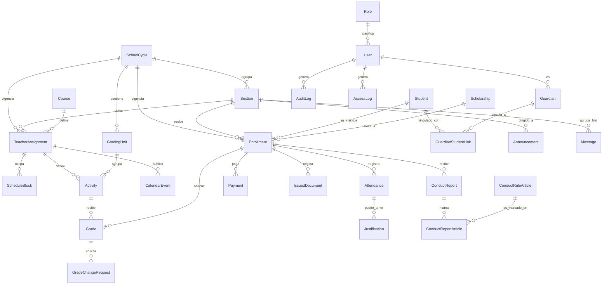

# Modelo de datos

Modelo físico derivado de las 25 entidades del Capítulo IV (sección 8 del prompt maestro), con las decisiones de [ADR-0001](adr/0001-modelado-talleres-como-seccion.md), [ADR-0002](adr/0002-relacion-encargado-estudiante.md), [ADR-0003](adr/0003-redondeo-nota-final.md) y [ADR-0004](adr/0004-bitacora-de-cambios-formato.md) ya incorporadas. 26 tablas: las 25 entidades originales más `GuardianStudentLink`, la tabla intermedia introducida por el ADR-0002.

Convenciones válidas para todas las tablas, salvo que se indique lo contrario:

- `id`: entero autoincremental, clave primaria interna. Nunca aparece en una URL.
- `public_id`: UUID v4, único, es lo que aparece en la API y en el frontend.
- `is_active`: baja lógica. Nada se borra de verdad (sección 8.5 del prompt maestro).
- `created_at`, `updated_at`: marca de tiempo automática en toda tabla que no sea de solo lectura (la bitácora y el registro de acceso son la excepción: son de solo escritura y no llevan `updated_at`).
- Toda relación "muchos a uno" es una llave foránea `NOT NULL` salvo que se marque `nullable`.

---

## 1. Área académica

### `catalog.SchoolCycle` — Ciclo escolar
| Columna | Tipo | Notas |
|---|---|---|
| year | integer, único | |
| start_date | date | |
| end_date | date | |
| status | enum: `planificado, activo, cerrado` | |

### `catalog.GradingUnit` — Unidad
| Columna | Tipo | Notas |
|---|---|---|
| cycle_id | FK → SchoolCycle | |
| number | integer 1–4 | |
| start_date | date | |
| end_date | date | |
| grades_due_date | date | RN-10: 15 días después de `end_date` |
| report_card_enabled_date | date, calculada | RN-10: 7 días después de `grades_due_date` |

Restricción: `unique(cycle_id, number)`.

### `catalog.Section` — Sección
| Columna | Tipo | Notas |
|---|---|---|
| cycle_id | FK → SchoolCycle | |
| grade | varchar | p. ej. "Primero básico" |
| letter | varchar, nullable | p. ej. "A"; nulo si es grupo único |
| type | enum: `academica, taller` | ADR-0001 |
| homeroom_teacher_id | FK → accounts.User, nullable | solo aplica si `type = academica` |

Índice: `(cycle_id, type)`.

### `catalog.Course` — Curso
| Columna | Tipo | Notas |
|---|---|---|
| name | varchar | |
| type | enum: `academico, taller` | ADR-0001 |

### `scheduling.TeacherAssignment` — Asignación docente
| Columna | Tipo | Notas |
|---|---|---|
| teacher_id | FK → accounts.User | |
| course_id | FK → Course | |
| section_id | FK → Section | |
| cycle_id | FK → SchoolCycle | |

Restricciones: `unique(teacher_id, course_id, section_id, cycle_id)`. Regla de dominio (no de base de datos, requiere el join): `Course.type == Section.type`.

### `scheduling.ScheduleBlock` — Bloque de horario
| Columna | Tipo | Notas |
|---|---|---|
| assignment_id | FK → TeacherAssignment | |
| day_of_week | enum: `lunes..viernes` | |
| period_number | integer 1–6 | RN-13 |

Restricción: `unique(assignment_id, day_of_week, period_number)`. Regla de dominio: un mismo `teacher_id` (a través de `assignment_id`) no puede tener dos bloques con el mismo `day_of_week` y `period_number` — es un cruce que involucra un join entre asignaciones, se valida en `scheduling/domain/`, no solo con la restricción de base de datos (RF-06, HU-06).

### `grading.Activity` — Actividad
| Columna | Tipo | Notas |
|---|---|---|
| assignment_id | FK → TeacherAssignment | solo válida si `Course.type = academico` (ADR-0001) |
| unit_id | FK → GradingUnit | |
| activity_type_id | FK → catalog.ActivityType | |
| name | varchar | |
| max_score | decimal(5,2) | |
| is_short_quiz | boolean | derivado de `ActivityType`, ver ADR-0003 |
| due_date | date | |

Regla de dominio (ADR-0003, RN-01/RN-02/RN-04 revisada): por cada `(assignment_id, unit_id)`, la suma de `max_score` debe ser exactamente 100, y debe haber al menos 4 actividades con `is_short_quiz = true`.

### `grading.Grade` — Calificación
| Columna | Tipo | Notas |
|---|---|---|
| enrollment_id | FK → students.Enrollment | |
| activity_id | FK → Activity | |
| raw_score | decimal(5,2) | punteo real original, RN-05, nunca se sobrescribe |
| current_score | decimal(5,2) | igual a `raw_score` hasta que una `GradeChangeRequest` se aprueba; es la que entra en los promedios y la única que ve la familia (RN-06) |
| source | enum: `manual, plantilla` | sección 8.5 |
| recorded_by_id | FK → accounts.User | |

Restricción: `unique(enrollment_id, activity_id)`.

### `grading.GradeChangeRequest` — Modificación de nota
| Columna | Tipo | Notas |
|---|---|---|
| grade_id | FK → Grade | |
| original_score | decimal(5,2) | copia de `raw_score` al momento de la solicitud |
| requested_score | decimal(5,2) | |
| reason | text | |
| requested_by_id | FK → accounts.User | |
| status | enum: `pendiente, aprobada, rechazada` | RF-10, RF-23 |
| authorized_by_id | FK → accounts.User, nullable | solo Dirección, RN-05 |
| decided_at | datetime, nullable | |

---

## 2. Área de estudiantes y control administrativo

### `students.Student` — Estudiante
| Columna | Tipo | Notas |
|---|---|---|
| internal_code | varchar, único | RN-14, HU-03; asignado por el sistema, no por el Ministerio |
| first_name, last_name | varchar | |
| birth_date | date | |
| address | text | |
| previous_institution | varchar, nullable | |
| health_notes | text, nullable | **acceso reservado a Dirección**, RNF-04 |
| socioeconomic_notes | text, nullable | **acceso reservado a Dirección**, RNF-04 |

Índice: `internal_code`.

### `students.Guardian` — Encargado
| Columna | Tipo | Notas |
|---|---|---|
| user_id | FK → accounts.User, único (1 a 1) | ADR-0002 |
| full_name | varchar | |
| phone | varchar, nullable | |
| messaging_number | varchar, nullable | |
| occupation | varchar, nullable | |

`parentesco` no vive aquí — ver `GuardianStudentLink` (ADR-0002).

### `students.GuardianStudentLink` — Vínculo encargado↔estudiante *(introducida por ADR-0002, no está en la lista original de 25 entidades)*
| Columna | Tipo | Notas |
|---|---|---|
| guardian_id | FK → Guardian | |
| student_id | FK → Student | |
| relationship | varchar | parentesco de este vínculo específico |
| is_primary | boolean | para desempatar cuál encargado aparece primero en listados internos |

Restricción: `unique(guardian_id, student_id)`.

### `students.Enrollment` — Inscripción
| Columna | Tipo | Notas |
|---|---|---|
| student_id | FK → Student | |
| section_id | FK → Section | |
| cycle_id | FK → SchoolCycle | |
| scholarship_id | FK → payments.Scholarship, nullable | |
| status | enum: `activo, retirado, graduado, trasladado` | |
| enrolled_at | date | |

Restricción: `unique(student_id, cycle_id, section_id)` — HU-03: no se inscribe dos veces al mismo estudiante **en la misma sección**. Corregido durante la Fase 6, al construir la asistencia de talleres: la sección 1 del prompt maestro describe participantes de taller que son, al menos en parte, los mismos estudiantes de la jornada matutina, así que un estudiante necesita poder tener a la vez su sección académica y una de taller en el mismo ciclo. La regla de "una sola sección académica por ciclo" se valida en `students/services/enrollment.py`, no con una restricción de base de datos (que no puede mirar el tipo de una tabla relacionada sin duplicar esa columna). Esta es la entidad central del modelo (sección 8 del prompt maestro): todo lo académico, de asistencia, de pagos y de documentos cuelga de aquí, no directamente de `Student`.

### `attendance.Attendance` — Asistencia
| Columna | Tipo | Notas |
|---|---|---|
| enrollment_id | FK → Enrollment | aplica igual a jornada matutina y a talleres (ADR-0001) |
| date | date | |
| status | enum: `presente, tarde, ausente, justificado` | HU-16 |
| source | enum: `manual, plantilla` | RF-21 para talleres |
| recorded_by_id | FK → accounts.User | |

Restricción: `unique(enrollment_id, date)`. RN-11 (tardanza a las 8:05, pérdida del primer período) se implementa como regla de dominio sobre `status = tarde`, no como una columna aparte.

### `attendance.Justification` — Justificación
| Columna | Tipo | Notas |
|---|---|---|
| attendance_id | FK → Attendance | |
| justification_type_id | FK → catalog.JustificationType | |
| reason_detail | text | |
| supporting_document | file, nullable | |
| resolution | enum: `pendiente, aprobada, rechazada` | RN-12: "se evalúa según el caso" |
| resolved_by_id | FK → accounts.User, nullable | |
| resolved_at | datetime, nullable | |

### `payments.Payment` — Pago
| Columna | Tipo | Notas |
|---|---|---|
| enrollment_id | FK → Enrollment | |
| period_month | integer 1–12 | |
| period_year | integer | |
| amount | decimal(8,2) | |
| payment_date | date | |
| receipt_number | varchar, único | |
| recorded_by_id | FK → accounts.User | solo Encargado de pagos o Dirección |

Restricción: `unique(enrollment_id, period_year, period_month)`.

### `payments.Scholarship` — Beca
| Columna | Tipo | Notas |
|---|---|---|
| name | varchar | |
| description | text | |

RN-08: un estudiante con `Enrollment.scholarship_id` no nulo y la beca activa aparece siempre solvente, sin importar `Payment`.

### `documents.IssuedDocument` — Documento emitido
| Columna | Tipo | Notas |
|---|---|---|
| document_type_id | FK → catalog.DocumentType | |
| enrollment_id | FK → Enrollment | |
| verification_code | varchar, único, aleatorio no correlativo | RF-14, sección 14.2 |
| file_reference | varchar | ruta/clave de almacenamiento, servida solo detrás de autorización |
| issued_at | datetime | |
| issued_by_id | FK → accounts.User | |

Índice: `verification_code` (único, consultado sin sesión desde la página de verificación).

---

## 3. Área de comunicación

### `scheduling.CalendarEvent` — Evento de calendario
| Columna | Tipo | Notas |
|---|---|---|
| title | varchar | |
| type | enum: `institucional, asignacion_docente` | |
| event_date | date | |
| start_time, end_time | time | |
| section_id | FK → Section, nullable | |
| assignment_id | FK → TeacherAssignment, nullable | |
| materials | text, nullable | |
| published_by_id | FK → accounts.User | RN-17: un docente solo edita lo que publicó |

### `communication.Announcement` — Aviso
| Columna | Tipo | Notas |
|---|---|---|
| title | varchar | |
| content | text | |
| audience | enum: `todos, seccion` | |
| target_section_id | FK → Section, nullable | solo si `audience = seccion` |
| published_at | datetime | |
| expires_at | datetime, nullable | HU-36: vencidos dejan de mostrarse |
| published_by_id | FK → accounts.User | |

### `catalog.ConductRuleArticle` — Artículo del código de convivencia *(introducida por [ADR-0006](adr/0006-formato-reporte-conducta.md), a partir de `docs/reporte.docx`)*
| Columna | Tipo | Notas |
|---|---|---|
| chapter | varchar | p. ej. "CAPÍTULO I: RESPETO Y DIGNIDAD" |
| code | varchar | p. ej. "Art. 4" |
| description | varchar | p. ej. "Falta de respeto hacia educadores" |

Es el octavo dato maestro parametrizable, no estaba en los 7 de la sección 9 original — Dirección lo administra igual que los demás catálogos, porque el código de convivencia puede revisarse entre ciclos.

### `communication.ConductReport` — Reporte de conducta *(columnas ampliadas por [ADR-0006](adr/0006-formato-reporte-conducta.md))*
| Columna | Tipo | Notas |
|---|---|---|
| enrollment_id | FK → Enrollment | |
| report_date | date | |
| severity | enum: `leve, grave, muy_grave` | "Tipo de falta cometida" del formato |
| incident_description | text | "Hechos ocurridos" |
| immediate_actions | text | "Medidas inmediatas tomadas" |
| other_violation_detail | text, nullable | "Otra falta no especificada" |
| sanction_type | enum: `llamado_verbal, amonestacion_escrita, comunicacion_familia, suspension_extracurricular, servicio_comunitario, suspension_clases, evaluacion_expulsion, otra` | |
| sanction_detail | text, nullable | días de suspensión, rango de fechas, detalle del servicio comunitario o de "otra" |
| commitments | text | "Compromisos establecidos" |
| guide_teacher_id | FK → accounts.User | firma como Maestro Guía (impresa, RN-15) |
| direction_member_id | FK → accounts.User, nullable | firma como Miembro de Dirección |

### `communication.ConductReportArticle` — Artículos incumplidos en un reporte *(tabla de unión, ADR-0006)*
| Columna | Tipo | Notas |
|---|---|---|
| conduct_report_id | FK → ConductReport | |
| article_id | FK → catalog.ConductRuleArticle | |

Restricción: `unique(conduct_report_id, article_id)`. Un reporte de conducta marca cero o más artículos del catálogo (checklist del formato original), además del texto libre de `other_violation_detail`.

### `communication.Message` — Mensaje de buzón
| Columna | Tipo | Notas |
|---|---|---|
| sender_id | FK → accounts.User | encargado que envía, o Dirección/maestro guía que responde |
| section_id | FK → Section | define quién más ve el hilo: el maestro guía de esa sección y Dirección (HU-25) |
| subject | varchar | solo en el mensaje raíz |
| content | text | |
| original_message_id | FK → Message, nullable, self | nulo = mensaje raíz del hilo |
| status | enum: `enviado, leido, respondido` | |

---

## 4. Área de seguridad y registro

### `accounts.Role` — Rol
| Columna | Tipo | Notas |
|---|---|---|
| name | varchar, único | Dirección, Coordinación, Encargado de pagos, Docente, Docente con sección a cargo, Tallerista, Padre de familia, Administrador del sistema |
| permissions | JSON | mapa área → `ver / editar / sin_acceso`, ver `docs/permisos-roles.md` |

### `accounts.User` — Usuario
| Columna | Tipo | Notas |
|---|---|---|
| username | varchar, único | |
| email | varchar, nullable | muchas familias no tienen correo activo |
| password_hash | varchar | |
| role_id | FK → Role | |
| must_change_password | boolean | contraseña temporal de un solo uso, sección 14.1 |
| failed_login_attempts | integer | |
| locked_until | datetime, nullable | sirve tanto para el límite de intentos (14.1) como para RN-16 |
| last_login_at | datetime, nullable | |

### `core.AuditLog` — Bitácora de cambios *(solo escritura, ver ADR-0004)*
| Columna | Tipo | Notas |
|---|---|---|
| user_id | FK → accounts.User | |
| entity_name | varchar | p. ej. `grading.Grade` |
| entity_id | integer | |
| action | enum: `crear, actualizar, eliminar` | |
| old_value | JSON | |
| new_value | JSON | |
| created_at | datetime | |

Índices: `(entity_name, entity_id, created_at)`, `(user_id, created_at)`.

### `core.AccessLog` — Registro de acceso *(solo escritura)*
| Columna | Tipo | Notas |
|---|---|---|
| user_id | FK → accounts.User | |
| screen_viewed | varchar | ruta/pantalla consultada |
| accessed_at | datetime | |

Índices: `(user_id, accessed_at)`, `(accessed_at)` — alimenta los indicadores del estudio (RNF-07).

---

## 5. Diagrama entidad-relación

El diagrama se divide por área para mantenerse legible; `Enrollment` es el nodo que las conecta todas.

Diagrama físico completo (columnas, tipos y restricciones) queda en las tablas de las secciones 1 a 4 de este documento; el diagrama Mermaid muestra solo cardinalidad y propósito de cada relación, no cada columna.

---

## 6. `TODO(confirmar)` pendientes de este modelo

- ~~Método exacto de redondeo de la nota final~~ — **confirmado**: redondeo aritmético estándar (ver ADR-0003, aceptado).
- ~~Bibliotecas para PDF, QR y lectura de plantillas~~ — **confirmadas**: WeasyPrint, `qrcode` y `openpyxl` (ver ADR-0005, aceptado).
- **Formato del `internal_code` de Estudiante — confirmado con una duda numérica sin resolver.** La dirección indicó el formato `ES01`, `ES02`... (prefijo `ES` + número secuencial). Con dos dígitos el rango es `ES01`–`ES99`, es decir 99 códigos posibles, y el centro ya tiene 144 estudiantes en la jornada matutina más los participantes de talleres. Para no bloquear el modelo se fija provisionalmente `internal_code` como `ES` + secuencial de **3 dígitos** (`ES001`...`ES999`), manteniendo el prefijo indicado. **Esto es una decisión tomada por el equipo técnico para resolver una contradicción numérica, no una confirmación literal de la dirección — queda como `TODO(confirmar)` real hasta que se valide antes de la Fase 5.** Si la intención era otra (por ejemplo, reiniciar la numeración cada ciclo, o que los dos dígitos identifiquen algo distinto al secuencial, como la sección), hay que corregirlo antes de generar el primer código real.
